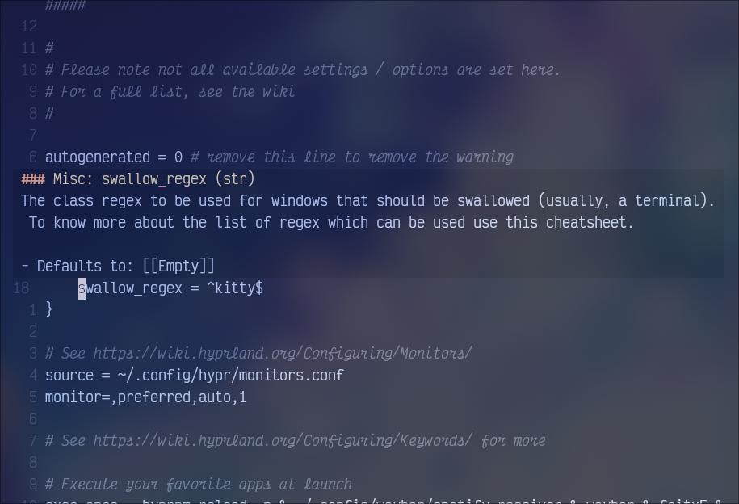

# HyprLS (huge WIP rn)



A LSP server for Hyprland configuration files.

## Installation


Right now you _have_ to build from source:

- Required: [Just](https://just.systems) (`paru -S just` on Arch Linux (btw))

```sh
git clone --recurse-submodules git@github.com:ewen-lbh/hyprlang-lsp.git
cd hyprlang-lsp
# installs the binary to ~/.local/bin. 
# Make sure that directory exists and is in your PATH
just install 
```

## Usage

Neovim example: add this to your `init.lua`:

```lua
-- Hyprlang LSP
vim.api.nvim_create_autocmd({'BufEnter', 'BufWinEnter'}, {
		pattern = {"*.hl", "hypr*.conf"},
		callback = function(event)
				print(string.format("starting hyprls for %s", vim.inspect(event)))
				vim.lsp.start {
						name = "hyprlang",
						cmd = {"hyprlang-lsp"},
						root_dir = vim.fn.getcwd(),
				}
		end
})
```
