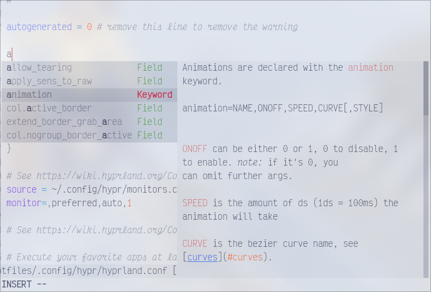
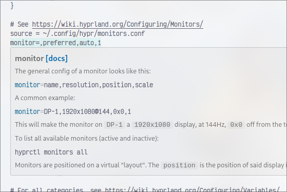
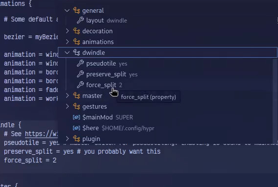
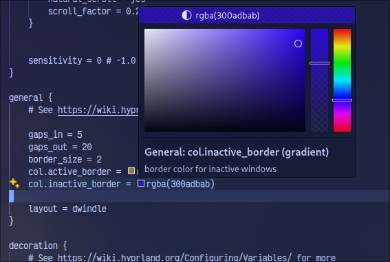

# HyprLS 

<table>
<tr>
	<td> 
	<td> 
</tr>
<tr>
	<td> 
	<td> 
	<td> 
</tr>
</table>

A LSP server for Hyprland configuration files.

## Features

Not checked means planned / work in progress.

- [x] Auto-complete
- [x] Hover
  - [ ] TODO: Documentation on hover of categories?
- [x] Go to definition
- [x] Color pickers
- [x] Document symbols
- [ ] Diagnostics
- [ ] Formatting
- [ ] Semantic highlighting

## Installation

### With `go install`

```sh
go install github.com/ewen-lbh/hyprls/cmd/hyprls@latest
```

### From source

- Required: [Just](https://just.systems) (`paru -S just` on Arch Linux (btw))

```sh
git clone --recurse-submodules https://github.com/ewen-lbh/hyprls
cd hyprls
# installs the binary to ~/.local/bin. 
# Make sure that directory exists and is in your PATH
just install 
```

## Usage

### With Neovim

_Combine with [The tree-sitter grammar for Hyprlang](https://github.com/tree-sitter-grammars/tree-sitter-hyprlang) for syntax highlighting._

Add this to your `init.lua`:

```lua
-- Hyprlang LSP
vim.api.nvim_create_autocmd({'BufEnter', 'BufWinEnter'}, {
		pattern = {"*.hl", "hypr*.conf"},
		callback = function(event)
				print(string.format("starting hyprls for %s", vim.inspect(event)))
				vim.lsp.start {
						name = "hyprlang",
						cmd = {"hyprls"},
						root_dir = vim.fn.getcwd(),
				}
		end
})
```

### VSCode

#### Official Marketplace (VisualStudio Marketplace)

Install it [from the marketplace](https://marketplace.visualstudio.com/items?itemName=ewen-lbh.vscode-hyprls).

> [!TIP]
> You can use [the Hyprland extension pack](https://marketplace.visualstudio.com/items?itemName=ewen-lbh.hyprland) to also get syntax highlighting.

#### Open VSX (for VSCodium & others)

Install it [on OpenVSX](https://open-vsx.org/extension/ewen-lbh/vscode-hyprls)
